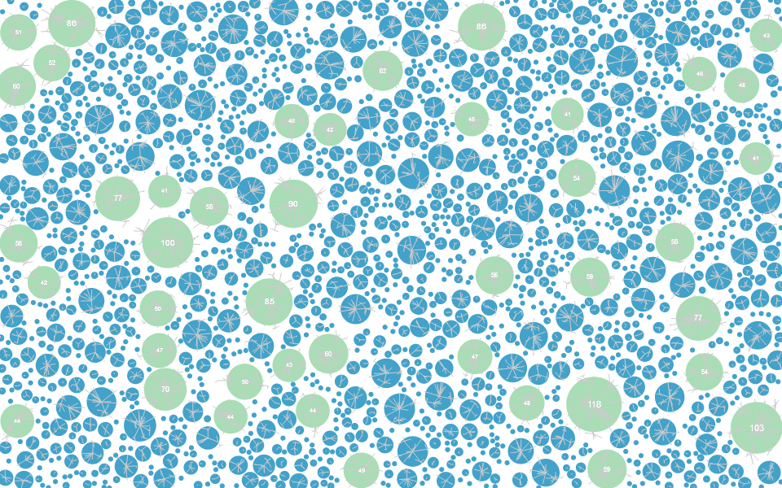
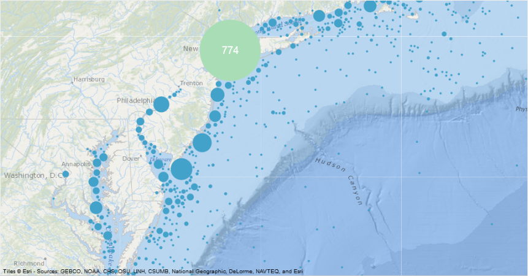
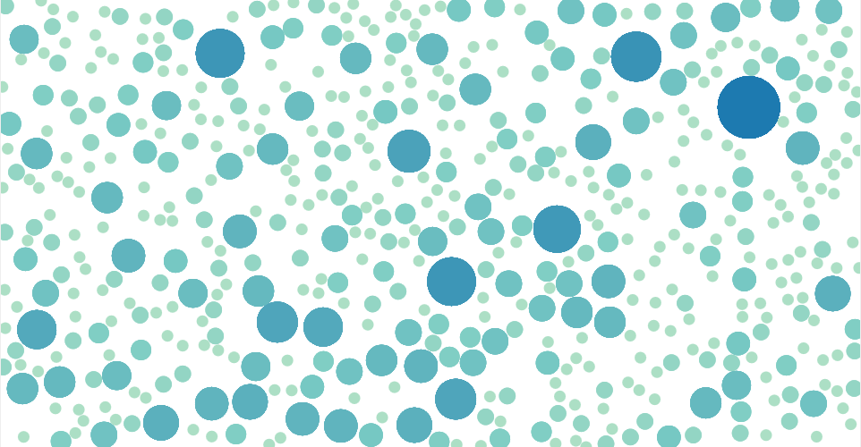
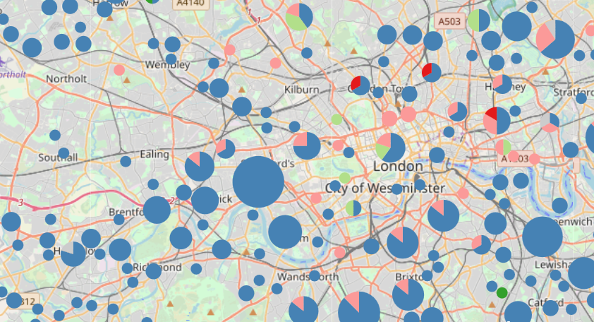

# d3-fuse

D3-fuse clusters circles by overlap. Overlap can be determined merely on radius or an additional padding specifier can be added. D3-fuse uses D3-quadtree in order to search for overlapping nodes, this is the only D3 dependency. The clustering pattern is not based on the number of circles within a gridded space but on overlap of nodes which allows for a less square appearance of clustered nodes.

*This is a related project of my initial [cluster attempt](https://github.com/Andrew-Reid/d3-marker-cluster) which uses a modified force layout (I intend to continue that as a force for force layouts).* 

<a href="https://bl.ocks.org/Andrew-Reid/6edf5fea96a6987ee53b8683c42aa50b"></img></a>


<a href="https://bl.ocks.org/Andrew-Reid/34d41d92aa3c2ff61cce4ae0bd23106a"></img></a>

<a href="https://bl.ocks.org/Andrew-Reid/0d7b626f4b83429fff94e79e3884ab60"></img></a>


<a href="https://bl.ocks.org/Andrew-Reid/cd6c23214147ddea4336b1f50238e3d6"></img></a>


### d3.fuse(*nodes*)

Returns a fuse layout. Can be optionally supplied with an array of nodes. 

### fuse()

Actually conducts the fuse/merge/cluster. This function works in steps, completing when no circles overlap given their radii and a padding value.

Adds/overwrites a `layout` property to each node in the data array after fusing/merging/clustering overlapping nodes. The `layout` property contains several properties:

```
x: the x position of the node
y: the y position of the node
r: the radius of the node
a: the area of the node
count: the number of nodes represented by this node
parent: an object containing the node that swallowed this node
children: an array containing the nodes that this node swalloed.
```

When node's overlap, the larger node "swallows" the smaller one. This means a few things for the properties of the node's layout property:
1. The large one's count is increased by an amount equal to the count of the smaller node.
2. The larger node is assigned as the parent property of the smaller one.
3. The smaller node is added to the children property of the larger one.
4. The radius of the smaller node is set to zero.


### fuse.nodes(*nodes*)

If `nodes` is provided will set the nodes for the fuse layout, returning the fuse layout. If `nodes` is not specified, returns the nodes of the layout.

### fuse.padding(*padding*)

If `padding` is provided applies a padding value to all overlap calculations and returns the fuse layout. The padding value is added to the combined distance of the radii of the two nodes. This distance is compared against the actual distance between two nodes' centers to determine overlap (negative values will allow circles to overlap by the specified padding value without merging, positive values will merge circles that do not touch).

### fuse.x(*x*)

Specifies the x accessor or value for placement of node centers horizontally. Can be provided a number or a function. Default value is:

``` function(d) { return d.x; }) ```


### fuse.y(*y*)

Specifies the y accessor or value for placement of node centers vertically. Can be provided a number or a function. Default value is:

``` function(d) { return d.y; }) ```

### fuse.radius("r")

Specifies the radius accessor or value for determining node radius. Can be provided a number or a function. Default value is 1.

### fuse.area("a")

Specifies the area or value for determining node area. Can be provided a number or a function. Default value is pi.

### fuse.defuse()

Removes the layout data from the nodes array.

### fuse.step()

Goes through all circles and checks for overlaps based on positions at beginning of step. `fuse()` keeps stepping until no more circles overlap, a single step may or may not result in residual overlap. 

### fuse.fuse()

Step until no circles overlap. Same as `fuse()` but returns the layout rather than the nodes.

